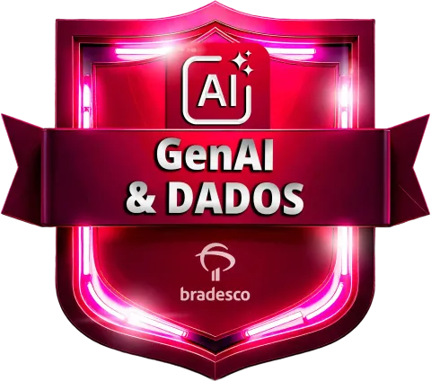
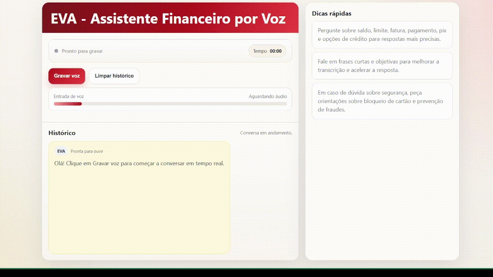

# Assistente de Voz EVA

<a href="logo_bootcamp.png"></a>

## Sobre este projeto

Este projeto faz parte do meu estudo e prática no **Bootcamp Bradesco - GenAI & Dados**, realizado em parceria com a [DIO](https://www.dio.me/bootcamp/bradesco-genai-dados).

O objetivo é construir um assistente de voz que recebe áudio do microfone, transcreve com **Whisper**, envia a pergunta para a **API de IA**, sintetiza a resposta com **gTTS** e devolve o resultado em áudio no navegador.

## Bootcamp Bradesco - GenAI & Dados

Este bootcamp tem como foco o desenvolvimento de habilidades em **IA generativa** e **ciência de dados**, preparando profissionais para aplicar tecnologia em cenários reais.

## Objetivo do projeto

Desenvolver um assistente de voz completo, executado em ambiente containerizado com Docker, capaz de demonstrar na prática a integração entre diferentes serviços de Inteligência Artificial em um fluxo real de aplicação.

## Demonstração do projeto




## Fluxo da aplicação

1. O usuário fala no microfone do navegador.
2. O áudio é gravado no frontend.
3. O Whisper transcreve a fala para texto.
4. A Groq gera a resposta em linguagem natural.
5. O gTTS transforma a resposta em áudio.
6. O navegador reproduz a resposta gerada.

## Estrutura do projeto

- [**app/main.py**](app/main.py): bootstrap da aplicação FastAPI.
- [**app/routes/voice.py**](app/routes/voice.py): endpoint principal de voz.
- [**app/services/transcricao.py**](app/services/transcricao.py): transcrição com Whisper.
- [**app/services/ia_service.py**](app/services/ia_service.py): geração da resposta com Groq.
- [**app/services/tts_service.py**](app/services/tts_service.py): síntese de áudio com gTTS.
- [**static/index.html**](static/index.html): interface web para gravar e ouvir a resposta.
- [**video_exemplo_projeto2_bootcamp_bradesco_dio.mp4**](video_exemplo_projeto2_bootcamp_bradesco_dio.mp4): gravação de demonstração do projeto em execução.

## Como usar o repositório

1. Copie [.env.example](.env.example) para [.env](.env).
2. Preencha sua `GROQ_API_KEY` e, se quiser, ajuste os demais parâmetros.
3. Suba a aplicação com Docker Compose.
4. Acesse a interface em `http://localhost:8000`.
5. Grave sua voz, aguarde a transcrição e ouça a resposta sintetizada.

```bash
docker compose up --build
```

## Endpoints

- `POST /api/voice` - recebe o áudio do microfone e retorna transcrição, resposta e áudio gerado.
- `GET /api/health` - verifica se a API está ativa.

## Tecnologias utilizadas

- FastAPI
- Whisper
- Groq
- gTTS
- Docker
- HTML + JavaScript

## Variáveis de ambiente

Use [.env](.env) no desenvolvimento local e cadastre as mesmas variáveis no Render pelo painel da plataforma.

- `PORT` - porta da aplicação, com fallback para `8000`.
- `WHISPER_MODEL` - modelo Whisper usado na transcrição.
- `GROQ_API_KEY` - chave da API da Groq.
- `GROQ_CHAT_MODEL` - modelo de chat usado na resposta.
- `GTTS_LANG` - idioma do gTTS.
- `GTTS_TLD` - domínio regional do gTTS.

Se `GROQ_API_KEY` não estiver configurada, o projeto usa uma resposta de demonstração para manter a experiência funcionando.

## Sobre o desenvolvimento

Este projeto utilizou o GitHub Copilot como apoio ao desenvolvimento.

Foram definidas instruções personalizadas em [.github/copilot-instructions.md](.github/copilot-instructions.md) para padronizar arquitetura, separar responsabilidades e manter a execução via Docker como fluxo principal.

Todo o código foi revisado, ajustado e validado manualmente.